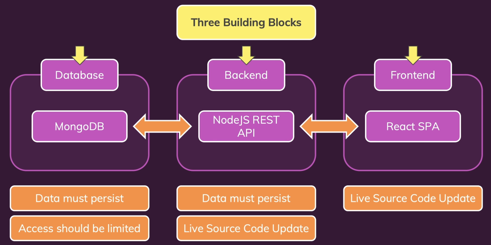

# Multi-Container

- [Multi-Container](#multi-container)
  - [Set up multi-container](#set-up-multi-container)



## Set up multi-container

```bash
# create Docker Network
$ docker network create goals-net

# Run MongoDB
$ docker run -d --name mongodb --network goals-net mongo

# Run Backend
$ docker run -d --name goals-backend -p 80:80 --network goals-net goals-node

# Run Frontend
$ docker run -d --name goals-frontend -p 3000:3000 -it goals-react
```